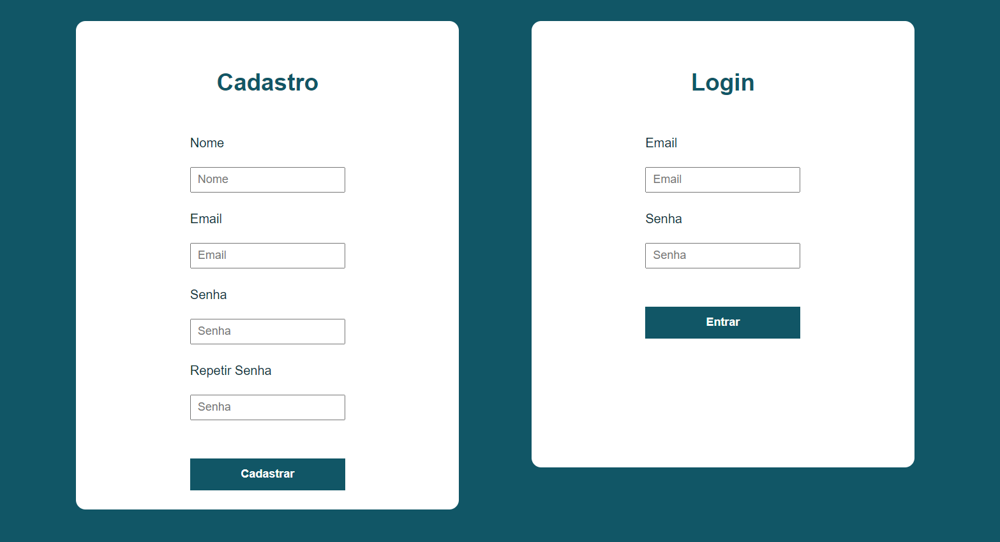
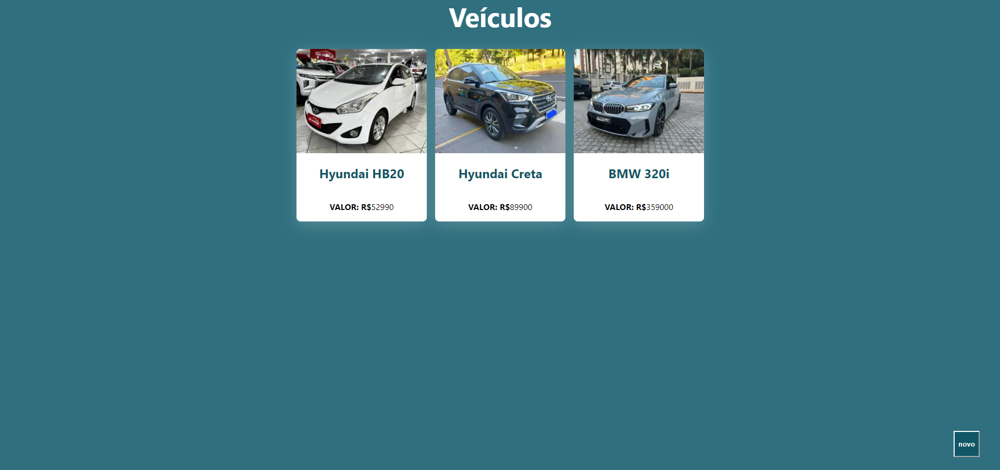
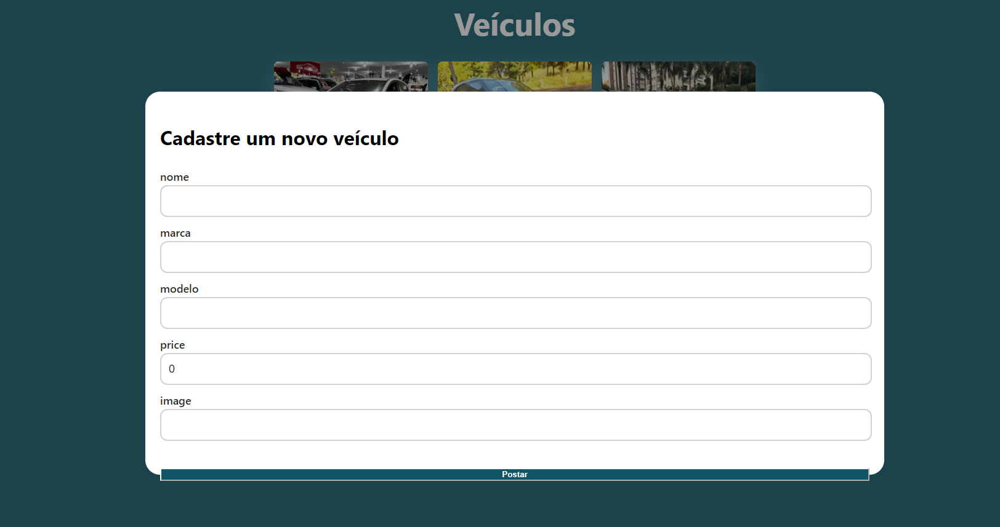
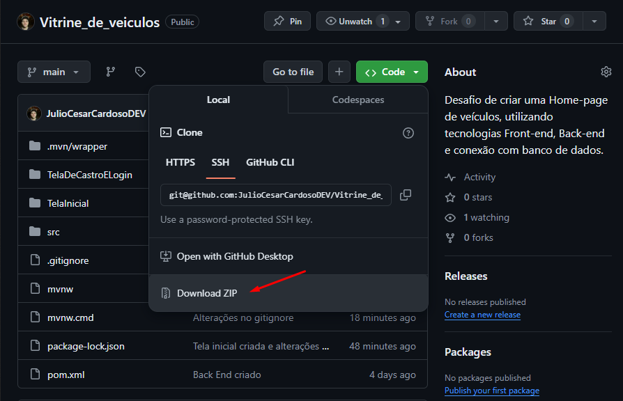
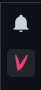
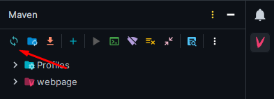
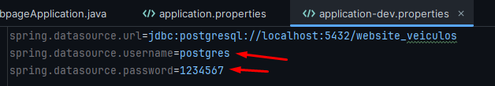

# Vitrine de Veículos 🚗🚗

Aplicação web simples de um catálogo de veículos. 

<h1 align="center">
    
    
    
</h1>

<br>
<br>
A aplicação foi desenvolvida usando **Java, SpringBoot, PostgreSQL, HTML, CSS, JavaScript, React, Typescript e React Query**.

## 💻 Requisitos

Antes de iniciar, você deve ter o Node.js e o NPM instalados em sua máquina, para o Front-End ser executado, além disso, é preciso ter o Java instalado na sua máquina e uma IDE que suporte a linguagem Java (Recomendo o Intellij, pois foi onde criei).

## Instalando o Projeto Back-End
<br>
Primeiro você deve clonar ou instalar o repositório.


```bash

# Clone o repositório
$ git clone https://github.com/JulioCesarCardosoDEV/Vitrine_de_veiculos.git

# Acessando
$ cd Vitrine_de_veiculos-main
```
Depois de abrir o projeto dentro do IntelliJ, é preciso instalar as depedências do Mavem, geralmente aparecem nas notificações do Intellij.



Depois é só atualizar o Maven.




É preciso também abrir o banco de dados PostegreSQl em sua máquina, e criar o database "website_veiculos".

Depois de criar o database, 
é preciso fazer a conexão com o banco de dados da maneira correta, no arquivo application-dev.properties na pasta de resources, colocando o username do seu banco e a sua senha do postgreSQL.



Para executar: entre no arquivo WebpageApplication e clique para executar o projeto.

## Instalando o Projeto Front-End
Abra o arquivo TelaInicial de maneira separada(Recomendo o Visual Studio Code).

Com ele aberto, abra o terminal e instale as dependências, execute o seguinte comando:

```bash
npm install
```

Por fim, para executar o Fron-End basta rodar o seguinte:

```bash
npm run dev
```
## Executando
Para executar, certifique-se que o banco de dados e o Front-End estejam rodando, após isso, abra o index.html da pasta TelaDeCastroELogin, realize o cadastro e após isso o login.
